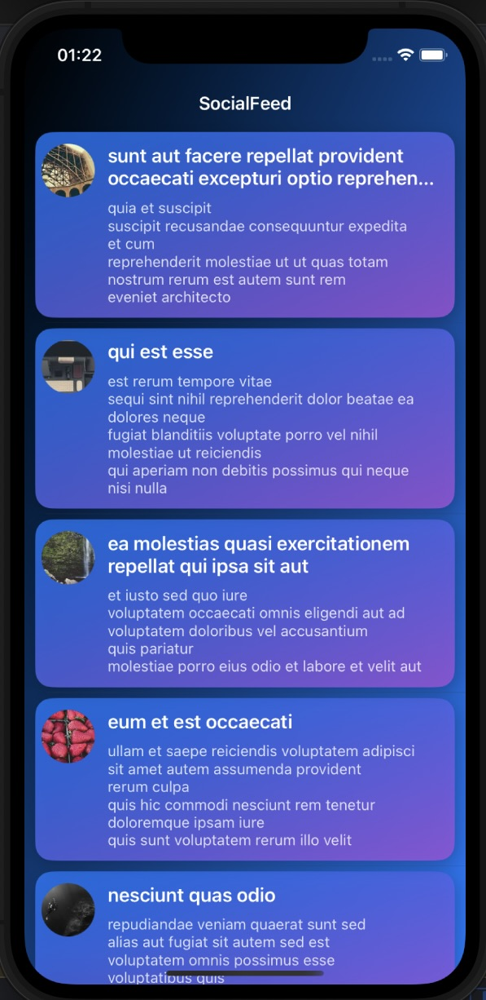

# 📱 SocialFeed

Приложение для просмотра ленты постов.

## 🔧 Используемые технологии:
- Swift + UIKit
- CoreData (локальное хранилище)
- Alamofire (запросы к API)
- Kingfisher (загрузка изображений)

## 📌 Возможности:
- Загрузка постов из API
- Кэширование в CoreData для оффлайн-доступа
- Pull-to-refresh обновление

## 🎨 Скриншот:

  
🔽 Нажмите, чтобы развернуть

  

## 🚀 Как запустить:
1. Склонировать проект:
git clone https://github.com/VALMAKS/SocialFeed.git
2. Открыть `SocialFeed.xcodeproj`
3. Запустить на симуляторе или устройстве

---
**Автор:** VALMAKS
[GitHub Profile](https://github.com/VALMAKS)
